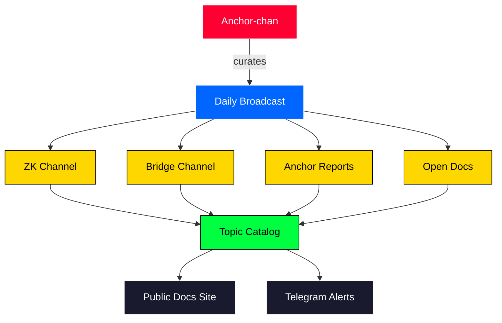

<h1 align="center">TVBridge</h1>
<p align="center"><em>A VHS-era television channel for ZK proof systems and cross-chain interoperability research.</em></p>

<p align="center">
  <a href="./LICENSE"></a>
  
  <a href="https://github.com/tvbridge-yt/tvbridge/actions/workflows/ci.yml"></a>
  <a href="https://twitter.com/tvb_yt"></a>
  <a href="https://tvb.yt"></a>
  <a href="https://github.com/tvbridge-yt/tvbridge/stargazers"></a>
</p>

TVBridge is the static catalog and Python package behind a VHS-styled
broadcast channel covering zero-knowledge proof systems and cross-chain
interoperability research. Anchor-chan reads the headlines, the topic
catalog feeds the docs site, and the episode catalog drives the schedule.

Think of it as a small reference library that happens to be wrapped in a
broadcast metaphor. Every episode points at one or more curated research
topics, every topic points at primary sources, and every weekly slot maps
to one of four channels.

## What's on the channels

- **ZK channel** - SNARKs, STARKs, recursive proofs, zkVMs.
- **Bridge channel** - light clients, IBC, LayerZero v2, Hyperlane, Wormhole, Axelar.
- **Anchor reports** - long-form weekly summaries from Anchor-chan.
- **Open docs** - working notes, papers under review, half-finished diagrams.

<p align="center"></p>

## Architecture



The full version, including the episode publishing flow, lives in
[docs/architecture.md](./docs/architecture.md).

<p align="center"></p>

## Programming schedule

| Day  | Time UTC | Channel       | Format                |
|------|----------|---------------|-----------------------|
| Mon  | 18:00    | zk            | Topic deep dive       |
| Tue  | 18:00    | bridge        | Topic deep dive       |
| Wed  | 20:00    | open-docs     | Working notes         |
| Thu  | 18:00    | zk            | Paper club            |
| Fri  | 21:00    | anchor        | Anchor-chan recap     |
| Sat  | 16:00    | bridge        | Field guide           |
| Sun  | -        | -             | Off air               |

## Installation

```bash
pip install -e .
```

For development:

```bash
pip install -e .[dev]
pytest -q
```

## Quick start

```python
from tvbridge.catalog import TOPICS, EPISODES
from tvbridge.utils.markdown import render_topic_card

groth16 = TOPICS["groth16"]
print(groth16.title, "-", groth16.channel)

# render a markdown card for the docs site
print(render_topic_card(groth16))

# walk the broadcast schedule
for number in sorted(EPISODES):
    ep = EPISODES[number]
    print(ep.code, ep.air_date, ep.title)
```

There are runnable examples under `src/examples/`:

```bash
python src/examples/list_topics.py
python src/examples/list_episodes.py
```

## Project structure

```
src/tvbridge/
  core/         dataclasses for episodes, topics, schedules
  catalog/      curated topic and episode catalog
  validators/   catalog validation rules
  utils/        slugify and markdown helpers
src/examples/   small runnable scripts
tests/          pytest suite
docs/           architecture and per-topic briefs
```

## Contributing

See [docs/contributing.md](./docs/contributing.md). Topic proposals go
through the issue template; small fixes can come straight as a pull
request.

## Links

- Website: [tvb.yt](https://tvb.yt)
- X: [@tvb_yt](https://twitter.com/tvb_yt)
- GitHub: [tvbridge-yt/tvbridge](https://github.com/tvbridge-yt/tvbridge)
- Ticker: $TVB
<!-- rev 3 -->
<!-- rev 7 -->
<!-- rev 11 -->
<!-- rev 15 -->
<!-- rev 19 -->
<!-- rev 23 -->
<!-- rev 27 -->
<!-- rev 31 -->
<!-- rev 35 -->
<!-- rev 39 -->
<!-- rev 43 -->
<!-- rev 47 -->
<!-- rev 51 -->
