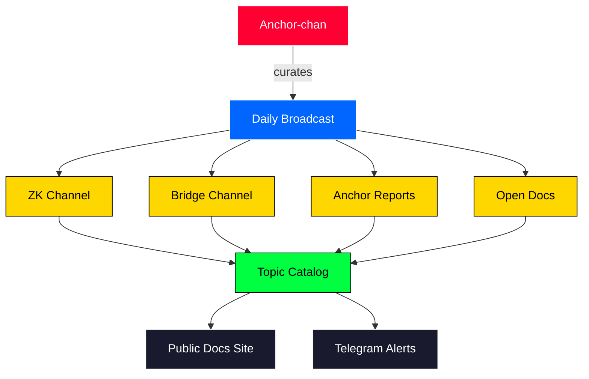
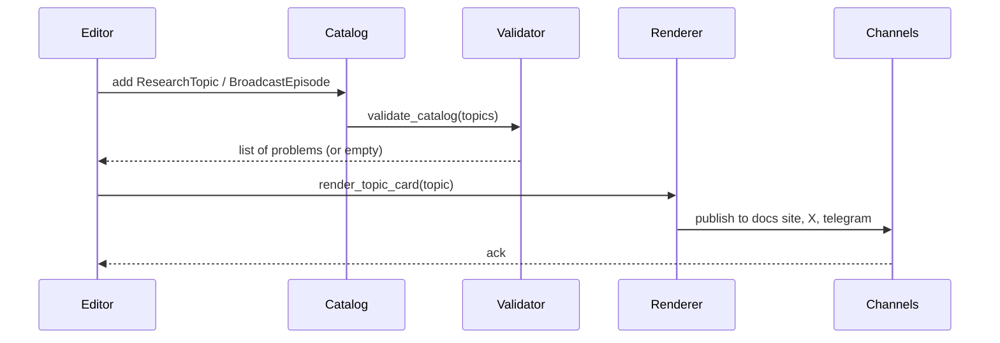

# Architecture

TVBridge is a small Python package plus a curated catalog. There is no server,
no database, and no daemon. The "broadcast" is a publishing convention layered
on top of plain dataclasses.

## Pieces

## Episode publishing flow

## Why dataclasses

The catalog is small and hand-curated. We do not want a database or a
schema migration story. Frozen dataclasses give us:

- a single source of truth in Python
- cheap validation in `__post_init__`
- easy diffs in pull requests
- straightforward import from any docs generator

## Channels

| Channel    | Color   | Cadence       | Audience           |
|------------|---------|---------------|--------------------|
| zk         | red     | weekly        | proof system nerds |
| bridge     | blue    | weekly        | interop engineers  |
| anchor     | gold    | bi-weekly     | general            |
| open-docs  | green   | continuous    | researchers        |
<!-- rev 0 -->
<!-- rev 4 -->
<!-- rev 8 -->
<!-- rev 12 -->
<!-- rev 16 -->
<!-- rev 20 -->
<!-- rev 24 -->
<!-- rev 28 -->
<!-- rev 32 -->
<!-- rev 36 -->
<!-- rev 40 -->
<!-- rev 44 -->
<!-- rev 48 -->
<!-- rev 52 -->
